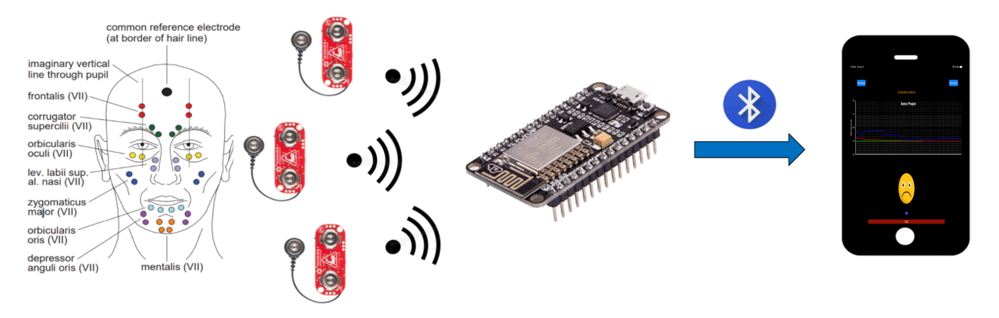
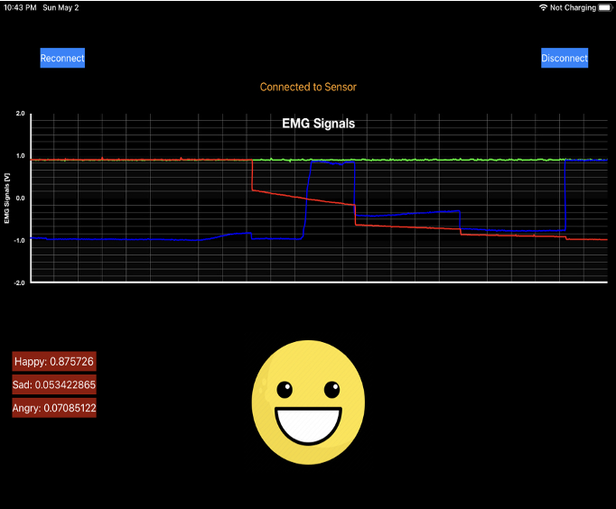

# EMG-Emotion-Prediction

## Introduction:

The purpose of the project is to develop a prototype for a wearable device that can detect users’ emotions. The implementation of the device will be composed of three major parts: collecting electromyography (EMG) signals from three sensors, storing and analyzing the collected data utilizing machine learning, and displaying the prediction on a smartphone application.

## Presentation Link: 

https://www.youtube.com/watch?v=Cc9PWFPVIpw&feature=youtu.be

## Results:

We were able to implement a prototype of the device that can predict three types of emotions: anger, happy and sad with up to 70% of accuracy. More details are included in the Documentation folder of the repo.

## Overview Diagram:

|  |
| :----------------------------------: |
|           _Overview_           |

## Mobile Application's UI:

|  |
| :----------------------------------: |
|           _Mobile Application's UI_      
